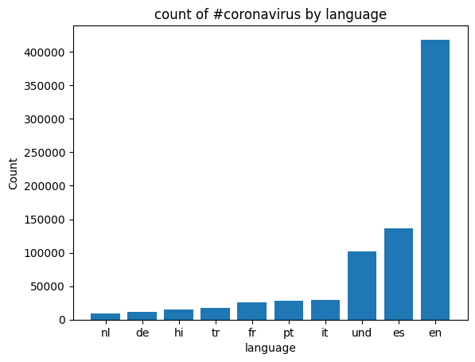
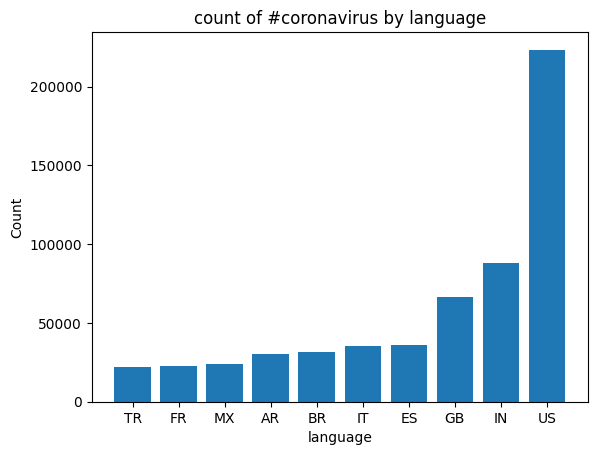
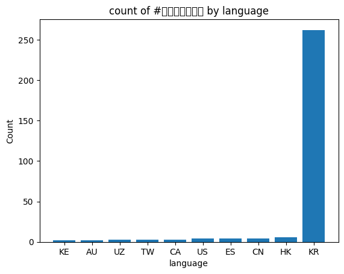

Twitter Mapreduce Project

## Project goal
This project aims to analyze the trend of tweets related to covid topics in the year of 2020. Essentially, I want to figure out during the year 2020, given specific hashtags, such as #hostpital, #flu, etc, which country has sent out the most tweet containing these hashtags and which language has the most tweets containing these hashtags. After this data analysis, we are able to extract insight on perhaps the most covid-affected countries and regions. 

## Background
**About the Data:**
Approximately 500 million tweets are sent everyday.
Of those tweets, about 2% are *geotagged*.
That is, the user's device includes location information about where the tweets were sent from.
My school's lambda server's `/data/Twitter dataset` folder contains all geotagged tweets that were sent in 2020.
In total, there are about 1.1 billion tweets in this dataset.
The tweets are stored as follows.
The tweets for each day are stored in a zip file `geoTwitterYY-MM-DD.zip`,
and inside this zip file are 24 text files, one for each hour of the day.
Each text file contains a single tweet per line in JSON format.
JSON is a popular format for storing data that is closely related to python dictionaries.

## Result

##implementation

### Step 1: Map
Generate intermediate outputs using mapping scripts.

#### Command:

sh run_maps.sh

---

### Step 2: Reduce
Aggregate the mapped data to generate meaningful insights.

#### Commands:
For language-based data:

python3 src/reduce.py --input_path outputs/*.lang --output_path reduce_language

For country-based data:

python3 src/reduce.py --input_path outputs/*.country --output_path reduce_country
---

### Step 3: Visualize
Create visualizations for specific keys or hashtags.

#### Command:

python3 src/visualize.py --input_path reduce_country --key "#코로나바이러스"

You can also replace `"#코로나바이러스"` with other keys from your hashtags file.

---

### Step 4: Usage Trend During the Year
Analyze usage trends for various hashtags throughout the year.

#### Command:

python3 src/alternative_reduce.py outputs "#covid2019" "#covid19" "#covid-2019" "#coronavirus" "#corona" "#virus" "#flu" "#sick"

