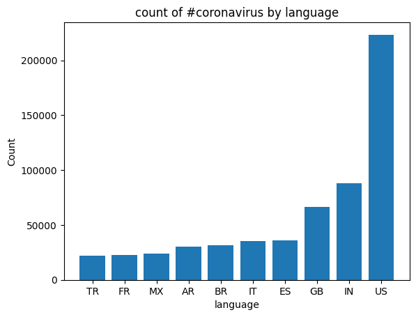
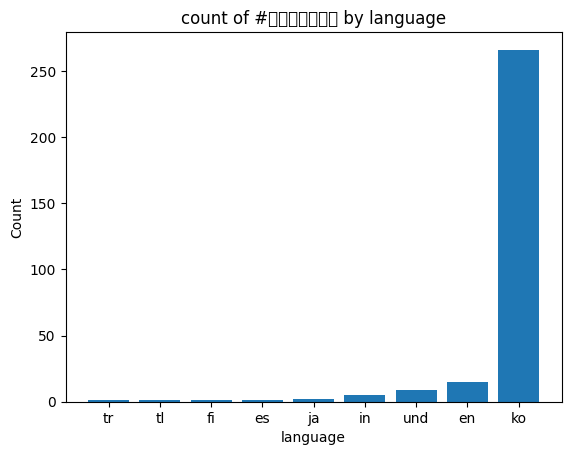

Twitter Data Analysis project

## Project goal
This project aims to analyze the trend of tweets related to covid topics in the year of 2020. Essentially, I want to figure out during the year 2020, given specific hashtags, such as #hostpital, #flu, etc, which country has sent out the most tweet containing these hashtags and which language has the most tweets containing these hashtags. After this data analysis, we are able to extract insight on perhaps the most covid-affected countries and regions. 

## Background
**About the Data:**
Approximately 500 million tweets are sent everyday.
Of those tweets, about 2% are *geotagged*.
That is, the user's device includes location information about where the tweets were sent from.
My school's lambda server's `/data/Twitter dataset` folder contains all geotagged tweets that were sent in 2020.
In total, there are about 1.1 billion tweets in this dataset.
The tweets are stored as follows.
The tweets for each day are stored in a zip file `geoTwitterYY-MM-DD.zip`,
and inside this zip file are 24 text files, one for each hour of the day.
Each text file contains a single tweet per line in JSON format.
JSON is a popular format for storing data that is closely related to python dictionaries.

## Result

##methodology
This project involves the
I create a map.py file
reduce.py 

I used the dataset containing all the tweets sent out during the 2020, witeach day's of tweets containing in a zip file. I ran a shell script running map.py parallel on all the zip files in the dataset to count the number of tweets associating with certain hashtags for each country and language.

